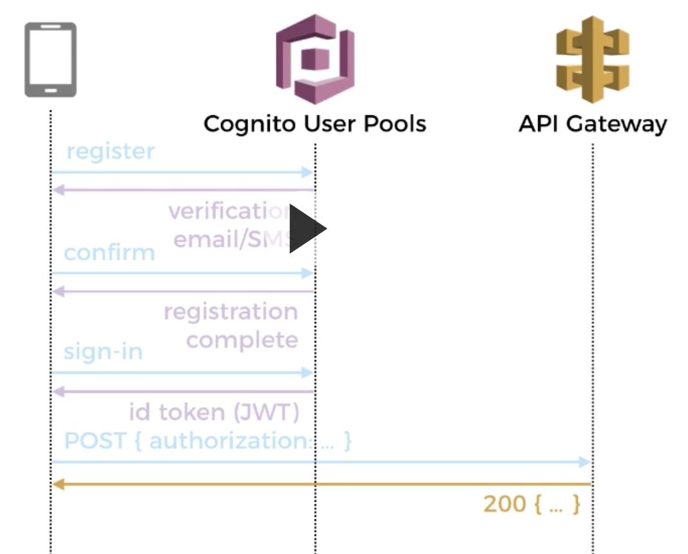

# Service Fabric

## lifecycle

#### Startup

1. The service is constructed.
2. Then, in parallel, two things happen:
   * `StatelessService.CreateServiceInstanceListeners()` is invoked and any returned listeners are opened. `ICommunicationListener.OpenAsync()` is called on each listener.
   * The service's `StatelessService.RunAsync()` method is called.
3. If present, the service's `StatelessService.OnOpenAsync()` method is called. This call is an uncommon override, but it is available. Extended service initialization tasks can be started at this time.

Keep in mind that there is no ordering between the calls to create and open the listeners and **RunAsync**. The listeners can open before **RunAsync** is started. Similarly, you can invoke **RunAsync** before the communication listeners are open or even constructed. If any synchronization is required, it is left as an exercise to the implementer. Here are some common solutions:

* Sometimes listeners can't function until some other information is created or work is done. For stateless services, that work can usually be done in other locations, such as the following:
  * In the service's constructor.
  * During the `CreateServiceInstanceListeners()` call.
  * As a part of the construction of the listener itself.
* Sometimes the code in **RunAsync** doesn't start until the listeners are open. In this case, additional coordination is necessary. One common solution is that there is a flag within the listeners that indicates when they have finished. This flag is then checked in **RunAsync** before continuing to actual work.

#### Shutdown

1. In parallel:
   * Any open listeners are closed. `ICommunicationListener.CloseAsync()` is called on each listener.
   * The cancellation token passed to `RunAsync()` is canceled. A check of the cancellation token's `IsCancellationRequested` property returns true, and if called, the token's `ThrowIfCancellationRequested` method throws an `OperationCanceledException`.
2. After `CloseAsync()` finishes on each listener and `RunAsync()` also finishes, the service's `StatelessService.OnCloseAsync()` method is called, if present. OnCloseAsync is called when the stateless service instance is going to be gracefully shut down. This can occur when the service's code is being upgraded, the service instance is being moved due to load balancing, or a transient fault is detected. It is uncommon to override `StatelessService.OnCloseAsync()`, but it can be used to safely close resources, stop background processing, finish saving external state, or close down existing connections.
3. After `StatelessService.OnCloseAsync()` finishes, the service object is destructed.

## Errors

### Global Error Handler

It doesn't have built-in global error handler like ASP.NET Core, so make sure you wrap the top-level method call with try catch block and handle the error message for logging. Otherwise, you will have an app that crashes silently.

```csharp
protected override async Task RunAsync(CancellationToken cancellationToken)
{
    while (true)
    {
        cancellationToken.ThrowIfCancellationRequested();

        try
        {
            await _processor.Run();
        }
        catch (Exception e)
        {
            _logger.LogError(e, $"{nameof(Worker)} has crashed.");
            throw;
        }

        var interval = TimeSpan.Parse(_options.Interval);
        _logger.LogInformation($"The execution is complete, now sleeping for {interval} ....");
        
        await Task.Delay(interval, cancellationToken);
    }
}
```

## Tips

### Using appsettings.json on .NET project

#### Install dependencies

```csharp
Microsoft.Extensions.Configuration.EnvironmentVariables
Microsoft.Extensions.Configuration.Json
microsoft.extensions.dependencyinjection
```

#### Create Options class to hold configuration variable

```csharp
public class TestOptions
{
    public string ConnectionString {  get; set; }
}
```

#### Wire-up IServiceCollection

```csharp
private static readonly IServiceCollection Services = new ServiceCollection();
public static IServiceProvider Build() {

  var configBuilder = new ConfigurationBuilder();
  
  configBuilder.AddEnvironmentVariables("ASPNETCORE_");
  configBuilder.AddJsonFile("appsettings.json", optional: true, reloadOnChange: true);
  configBuilder.AddEnvironmentVariables("Customers:");
  configBuilder.AddJsonFile($"appsettings.{environment}.json", true);

  var config = configBuilder.Build();
  Services.Configure<WorkerOptions>(config.GetSection("Worker"))
  
  var serviceBusSettings = 
    services.GetRequiredService<IOptions<ServiceBusOptions>>().Value;
    
  return Services.BuildServiceProvider();  
}
```

### RDP into a virtual machine scale set instance or a cluster node

* Go to Resource Group of a SF cluster
* Find Load Balancer
* Inbound NAT rules
* RDP into the destination IP: Port





